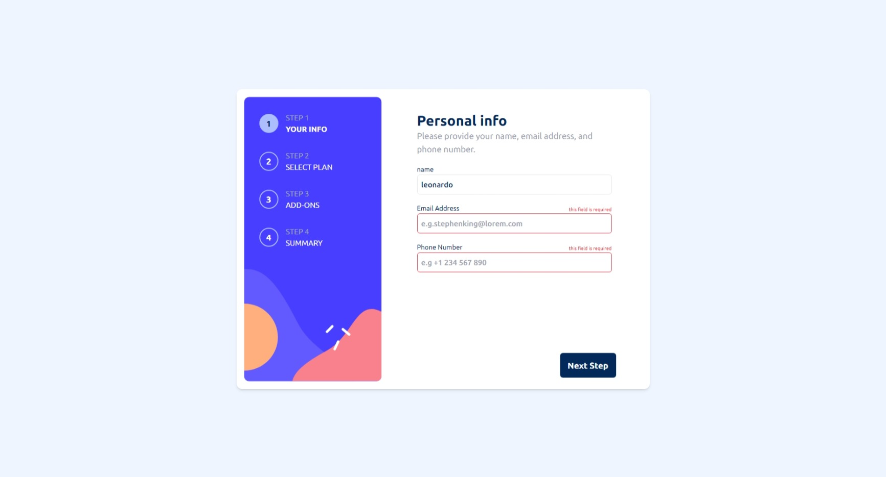
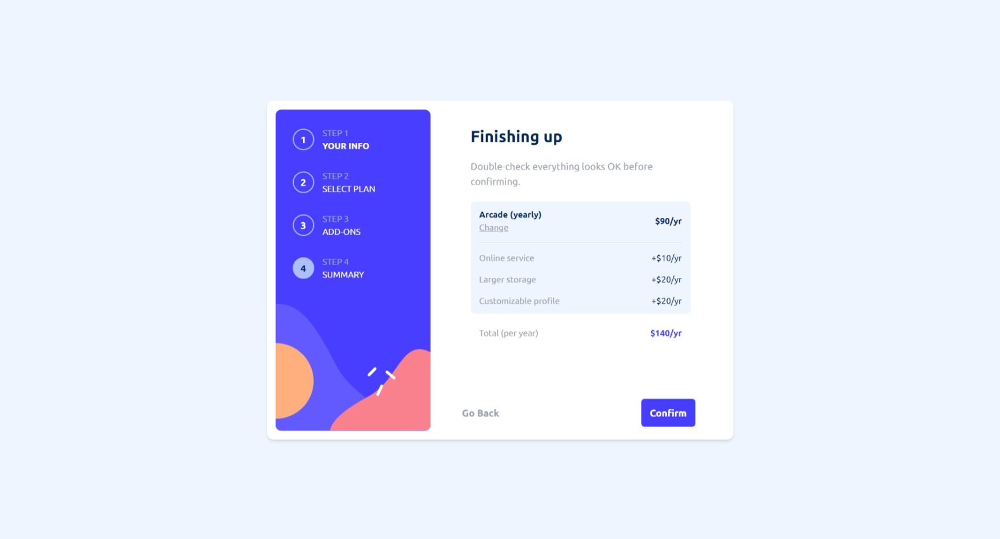
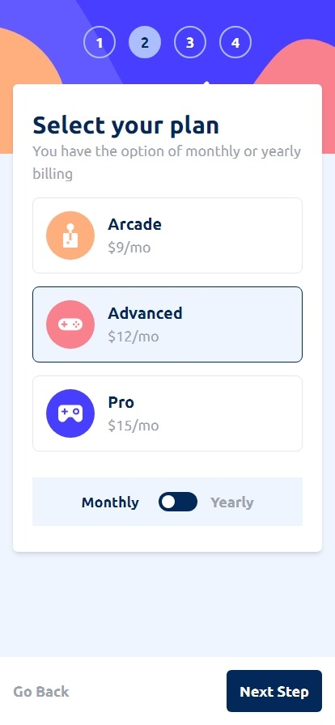
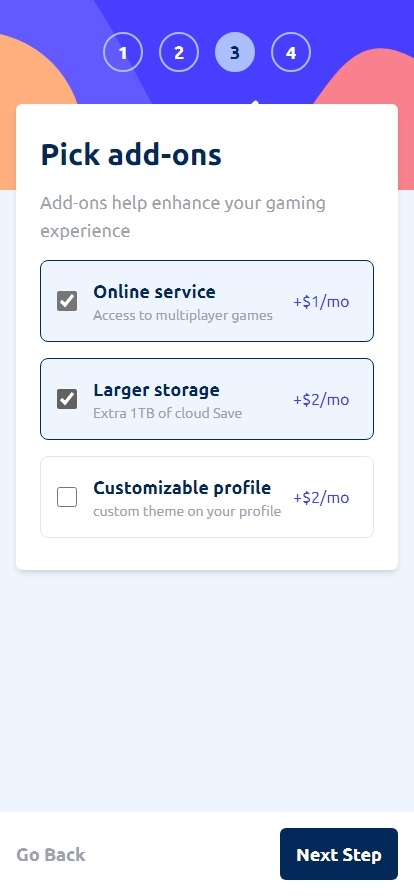

# Frontend Mentor - Multi-step form solution

This is a solution to the [Multi-step form challenge on Frontend Mentor](https://www.frontendmentor.io/challenges/multistep-form-YVAnSdqQBJ). Frontend Mentor challenges help you improve your coding skills by building realistic projects.

## Table of contents

- [Overview](#overview)
  - [The challenge](#the-challenge)
  - [Screenshot](#screenshot)
- [My process](#my-process)
  - [Built with](#built-with)
  - [What I learned](#what-i-learned)
- [Author](#author)

## Overview

### The challenge

Users should be able to:

- Complete each step of the sequence
- Go back to a previous step to update their selections
- See a summary of their selections on the final step and confirm their order
- View the optimal layout for the interface depending on their device's screen size
- See hover and focus states for all interactive elements on the page
- Receive form validation messages if:
  - A field has been missed
  - The email address is not formatted correctly
  - A step is submitted, but no selection has been made

### Screenshot






- Solution URL: [Solution URL here](https://www.frontendmentor.io/challenges/multistep-form-YVAnSdqQBJ)
- Live Site URL: [Live site URL ](https://next-multi-step.vercel.app/)

## My process

### Built with

- Semantic HTML5 markup
- CSS custom properties
- Flexbox
- Mobile-first workflow
- [React](https://reactjs.org/) - JS library
- [Next.js](https://nextjs.org/) - React framework
- [Tailwind Css](https://tailwindcss.com/) - For styles

### What I learned

I learned many fundamentals of typescript, and the basics about tailwindcss, in addition to react's context API, was a challenging project that I really enjoyed doing, just a detail, if you look at the console on the thank you screen there will be an object with all the information you selected.

```html
<h1>Hello world</h1>
```

```css
.proud-of-this-css {
  color: papayawhip;
}
```

```js
const proudOfThisFunc = () => {
  console.log('🎉');
};
```

## Author

- Frontend Mentor - [@leonardo9245](https://www.frontendmentor.io/profile/leonardo9245)
